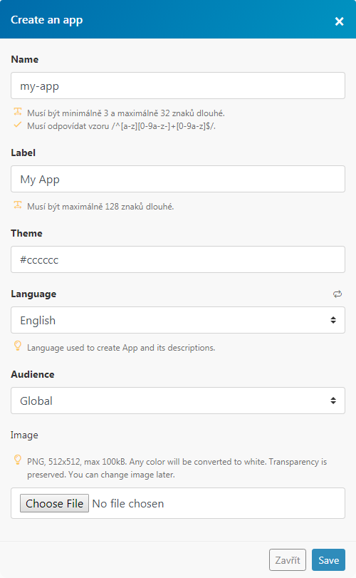
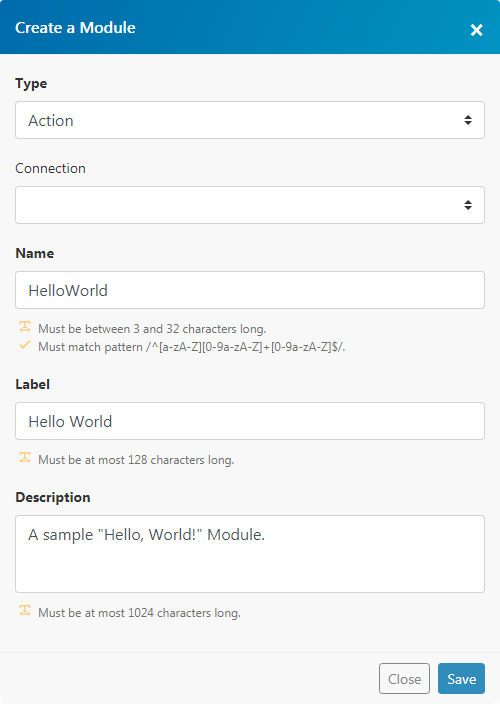
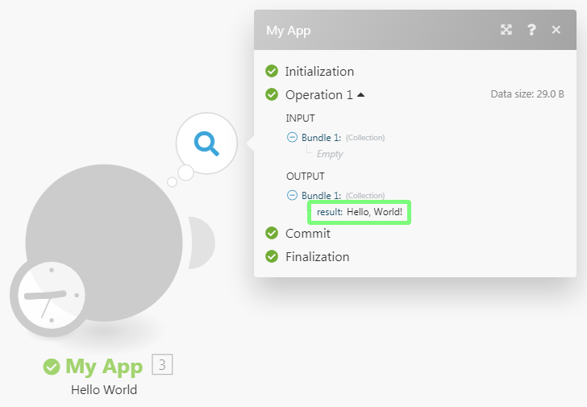
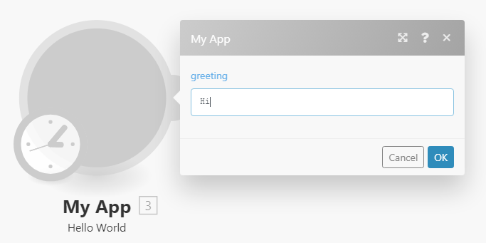
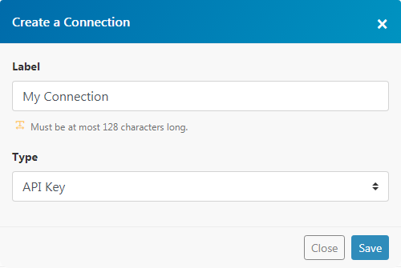

If you have searched through all the <a href="https://www.integromat.com/cs/integrations" target="_blank">apps/services</a> that Integromat already supports and did not find the one you would like to employ in your scenario, you are in the right place. This DIY guide will help you to create an Integromat App for the app/service without writing a piece of code. If the app/service provides an API then all you need to do is put together a few declarations in a simple JSON format. Throughout this guide we will use our **Virtual Library Demo API** that you can freely experiment with.

**TIP** To see if there is an API provided by the app/service you would like to integrate, try googling this: `API site:www.app-or-service.com`, for example: <a href="https://www.google.cz/search?q=API+site%3Awww.eventbrite.com" target="_blank">`API site:www.eventbrite.com`</a>

## Creating you first Integromat App

In the left main menu choose `My Apps`. The list of all your Apps will be shown containing few sample apps (`MailerLite`, `Slack` and `Tumblr`) that you can later explore. Click the button `Create a new App` in the right top corner. A dialog will pop up, where you can set some basic properties of your new App like its name etc. For the moment leave default values and click `Save`.



Your new App will appear in the list. Click on your new App. A page with five tabs will be shown: `Base`, `Connections`, `Webhooks`, `Modules` and `Remote Procedures` these are the main components your App will be composed of.

## Basic settings

The `Base` tab contains basic setting used by the other components of the module. You can see a dummy JSON snippet:

```json
{
    "baseUrl": "https://www.example.com"
}
```

Replace the url address `https://www.example.com` with the Demo API base url: `http://demo-api.integrokit.com/api/v1` and press <kbd>Ctrl</kbd>+<kbd>S</kbd> to save changes.

```json
{
    "baseUrl": "http://demo-api.integrokit.com/api/v1"
}
```

## Creating a module

Modules are the key component of your App. They are basically wrappers around specific app/service functionality, which is exposed via an API endpoint. There are three basic types of modules: `Action`, `Search` and `Trigger`. 

| Type | Description |
| --- | --- |
| **[Action](../action.html)** | Use if the API endpoint returns a single response. Examples are Insert a book, Remove a book or Get book info. |
| **[Search](../search.html)** | Use if the API endpoint returns multiple items. An example is List books that will find specific books according to search criteria. |
| **[Trigger](../trigger.html)** | Use if you wish to watch for any changes in your app/service. Examples are Watch new book, which will be triggered whenever a new book has been added to the library |

Let us start with a simple `Hello world` Module that will call our Demo API `/helloworld` endpoint without any parameters and simply pass the response: text `Hello, World!`.

Click the tab `Modules`. The list of all Modules your App consist of will be shown (empty for now). Click the large button with plus sign in the right top corner and choose `Create a new Module` from the dropdown menu. A dialog will pop up, where you can name your Module, choose its type and provide some description. Fill the dialog as shown and click `Save`.



The new Module will appear in the list. Click the Module and a page with several tabs will be shown. Make sure the tab `Communication` is active and replace the content of the text area with the following JSON snippet (again, press <kbd>Ctrl</kbd>+<kbd>S</kbd> to save changes):

```json
{
    "url": "/helloworld"
}
```

Click the tab `Mappable parameters`. The JSON on this tab enables you to specify parameters of your module that will appear in the <a href="https://www.integromat.com/en/kb/module.html" target="_blank">module settings panel</a>. Our module does not require any parameters, so erase the content between the square brackets, leaving just empty square brackets (<kbd>Ctrl</kbd>+<kbd>S</kbd>): 

```json
[]
```

**Congratulations, you have just created your first Integromat App!**

The App consists of one Action Module `Hello World` that calls the Demo API endpoint `/helloworld` and returns a Bundle containing the returned data, which is in our case the text `Hello, World!`.

You can test your new App right away. Open a new browser tab, login to integromat.com, in the left main menu choose `Scenarios` and create a new scenario. Click the yet undefined “questionnaire” Module to bring up a list of all the Apps. Search for your new App by typing its name in the `Search` field: `My App`. Click your App and a list of all its Modules will be shown, currently just the newly created `Hello World` Module. Click the Module to select it. An empty module settings panel will pop up saying "There are no configurable options for this module.". Close the panel and run the scenario. Click the bubbles above the module to pop up the panel with information about processed bundles. In case you have successfully followed this tutorial, you should see the following output of your new Module:



## Adding parameters

Let's enhance our simple `Hello World` module by adding some parameters to its settings panel. Switch back to the `Mappable parameters` tab and replace the empty square brackets with the following JSON:

```json
[
    {
        "name": "greeting",
        "type": "text"
    }
]
```

This JSON specifies that the module will have one parameter called `greeting` of type `text`. Press <kbd>Ctrl</kbd>+<kbd>S</kbd>, switch to your scenario and refresh the browser window (<kbd>F5</kbd>). Click the Module to pop up its settings panel. The panel now contains one text field labeled `greeting`. Fill `Hi!`:



Press `OK` and run the scenario. Though, if you click the bubbles above the Module to pop up the panel with information about processed bundles, there will be no change in the outpit from the previous run. To change the output of the module, we have to pass the content of the `greeting` parameter to the API. Switch back to the `Mappable parameters` tab and click the `Communication` tab. To pass the parameter `greetings` to the API, you have two options.

You can either add the parameter to the `url` key:

```json
{
    "url": "/helloworld?greeting={{parameters.greeting}}"
}
```

Or you can create a new key `qs` (query string) and add the parameter there:

```json
{
    "url": "/helloworld",
    "qs" : {
        "greeting": "{{parameters.greeting}}"
    }
}
```

## Customizing a request

Now, suppose that you want to retrieve a user. In order to do that, you
need to call the `/users/:id` method and specify the ID of the user you
want to retrieve. Here is how you would do that:

```json
{
    "url": "http://yourservice.com/api/users/{{parameters.userId}}"
}
```

To let user choose the parameter, add this to parameters:

```json
{
    "name": "userId",
    "type": "uinteger",
    "label": "User ID",
    "required": true
}
```

### Query string

If you need to specify a query string parameter, you can do:

```json
{
    "url": "http://yourservice.com/api/users/{{parameters.userId}}?includeAdvanced={{parameters.advanced}}"
}
```

But a better way is to use a special `qs` collection.

The `headers`, `qs` and `body` collections represent request headers,
query string parameters and body payload. The key is the variable/header
name and the value is the variable/header value. You don't need to
escape values inside those collections.

The above request can be rewritten as:

```json
{
    "url": "http://yourservice.com/api/users/{{parameters.userId}}",
    "qs": {
        "includeAdvanced": "{{parameters.advanced}}"
    }
}
```

### Headers

Now, lets say that your server wants only logged in users to view all
other users and it wants an `API-TOKEN` header with a correct value. We
can use the `headers` collection to specify this header:

```json
{
    "url": "http://yourservice.com/api/users/{{parameters.userId}}",
    "qs": {
        "includeAdvanced": "{{parameters.advanced}}"
    },
    "headers": {
        "API-TOKEN": "some-static-token"
    }
}
```

Cool, now we can make a request to a protected endpoint and retrieve a
list of users.

**NOTE**: `qs` and `headers` are single level collections, meaning that
you cannot specify nested objects in their parameters:

```json
{
    "qs": {
        "someProp": {
            "anotherOne": {
                "and-one-more": "THIS WILL NOT WORK"
            }
        }
    }
}
```

The example above will not work. But if you want dot notation for some
reason, you can use it directly in the parameter name:

```json
{
    "qs": {
        "someProp.anotherOne.and-one-more": "THIS WILL WORK"
    }
}
```

This will create a query string that looks like this:
`?someProp.anotherOne.and-one-more=THIS%20WILL%20WORK`

## Retrieving an array of items

Suppose you want to retrieve all users, that are registered on your
service. You can't use [Action](actions.html), because it returns only
single result. You will have to create a [Search](searches.html) module
for this.

The communication for [Search](searches.html) is the same as for
`Action`, except `Search` has an [`iterate`](response-object.html)
directive, that specifies where are the items located inside the body.

For the next example, suppose that when you call `/users` on your
service, you will get a list of users in `body.data`.

```json
{
    "url": "http://yourservice.com/api/users",
    "qs": {
        "includeAdvanced": "{{parameters.advanced}}"
    },
    "headers": {
        "API-TOKEN": "some-static-token"
    },
    "response": {
        "iterate": "{{body.data}}"
    }
}
```

This example will correctly output each user that was returned. But what
if you don't want to output all parameters? You can use the
[`output`](response-object.html) section to manually map response to
module's output:

```json
{
    "url": "http://yourservice.com/api/users",
    "qs": {
        "includeAdvanced": "{{parameters.advanced}}"
    },
    "headers": {
        "API-TOKEN": "some-static-token"
    },
    "response": {
        "iterate": "{{body.data}}",
        "output": {
            "id": "{{item.id}}",
            "username": "{{item.username}}"
        }
    }
}
```

## Creating a new Connection

We have covered the basics about creating a simple module. Now, let's
see how to update our search module with a variable API token for each
user.

Click the tab `Connections`. The (probably still empty) list of all your Connections will be shown. Click the large button with plus sign in the right top corner and choose `Create a new Connection` from the dropdown menu. A dialog will pop up, where you can name your Connection and choose its type. Fill the dialog as shown and click `Save`.



The new Connection will appear in the list. Click the new Connection. A page with two tabs will be shown: `Communication` and `Parameters`.

A pre-configured communication will look like this:

```json
{
    "qs": {},
    "url": "https://www.example.com/api/whoami",
    "body": {},
    "method": "GET",
    "headers": {
        "API-TOKEN": "{{parameters.apiKey}}"
    }
}
```

This section specifies a simple request to determine whether the
credentials entered by the user are valid or not. The most common way to
validate the credentials is to call an API to get user's information.
Most of the APIs have such an API.

Once you finish communication configuration, you can go back to your
Search module and click *Attach connection*. Once you select a
connection, you can update your Search's communication headers to
execute request with variable API token like this:

```json
{
    "headers": {
        "API-TOKEN": "{{connection.apiKey}}"
    }
}
```

